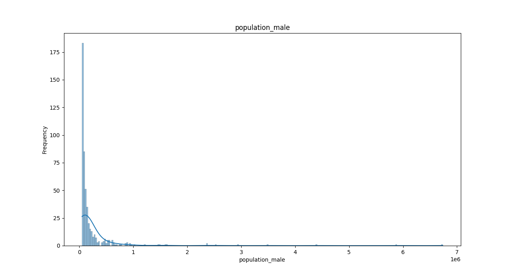
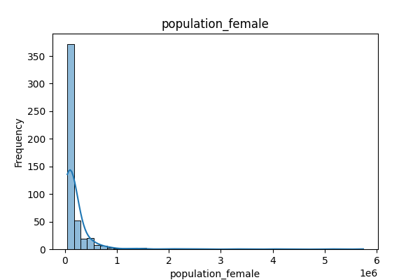
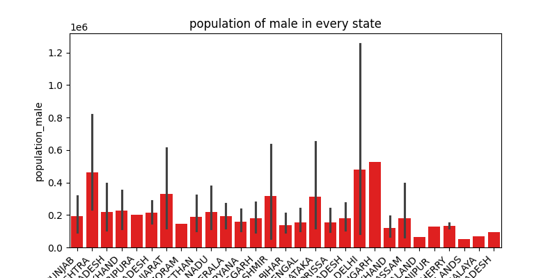
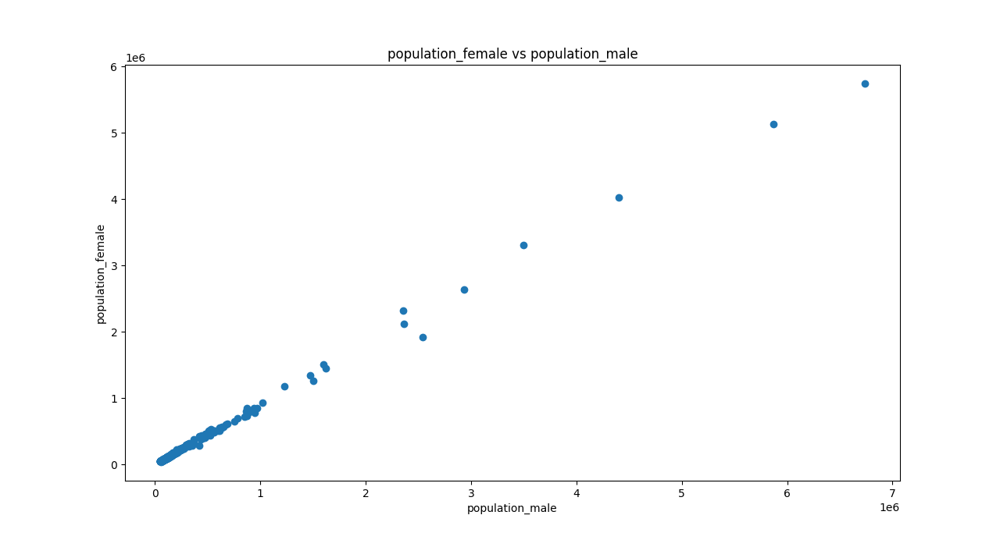

# 📊 Cities Population Analysis – India
This repository contains a basic Exploratory Data Analysis (EDA) on population data of Indian cities using Python libraries like pandas, matplotlib, and seaborn.

# 📁 Files
task_1.ipynb : Jupyter Notebook with code to visualize:

Male population distribution

Female population distribution

Bar chart of male population by state

Scatter plot between male and female populations

# 📌 Objectives
To explore the population distribution across Indian states.

To visualize the male and female population differences.

To practice histogram, bar chart, and scatter plot visualizations using Seaborn and Matplotlib.

# 🧰 Libraries Used
python
pandas
seaborn
matplotlib
# 📷 Sample Visualizations

# ✅ How to Run
Clone this repo or download the .ipynb file.

Open with Jupyter Notebook or VS Code (with Jupyter extension).

Ensure your CSV file path is correct:
df = pd.read_csv('path_to/cities_india.csv')
📄 Dataset Info
The dataset used: cities_india.csv

Must include columns:

state_name

population_male

population_female
